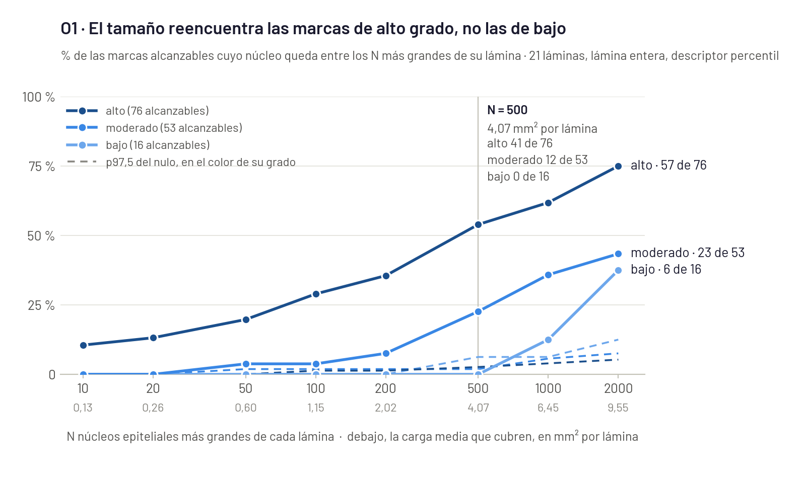
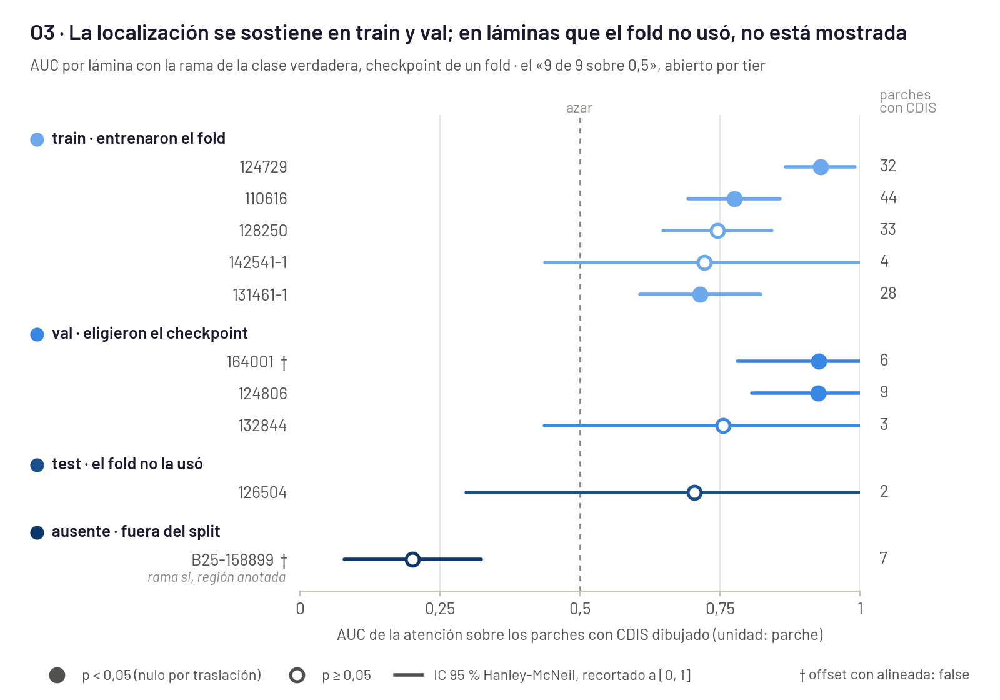

# Reunión del martes 15-sep con Sebastián

> Preparado el 11-sep-2026, sesión 53. Nada de lo que sigue se midió para este documento: sale de
> artefactos que ya estaban en disco. Las dos figuras las dibuja `scripts/b10_figuras_o1_o3.py`,
> que antes de dibujar compara cada número con su `resultados.md` y aborta si alguno no cuadra.
> Mapa del sprint: [`objetivos_sprint10.md`](objetivos_sprint10.md).

---

## 1. Los tres encargos del 7-sep

| encargo | qué se trae | detalle |
|---|---|---|
| Replicar el B9 sin la marca del patólogo (O1) | Con HoVer-NeXt solo, el tamaño reencuentra las marcas de alto grado y no las de bajo. En N = 500, unos 4 mm² por lámina: 41 de 76 contra 0 de 16 | §2 |
| Cómo se determina el score (O2) | El CAP no trae regla de cantidad ni de mayoría. Separa los scores por la variación de tamaño contra epitelio normal, y no dice qué hacer cuando el grado varía dentro de un mismo carcinoma | §3 |
| El CDIS antes que el grado (O3) | La atención cae sobre el CDIS dibujado en las 9 láminas con etiqueta, pero 8 de ellas el fold las usó para entrenar o para elegir el checkpoint. En las dos que no usó, la localización no está mostrada | §4 |

Las tres condiciones con que el mapa define el fin del B10 se cumplen. Qué se hace después depende
sobre todo de las respuestas a P1 y P2 (§5).

## 2. O1: el tamaño solo reencuentra el alto grado

*Unidad: marca del patólogo. Una marca cuenta como recuperada si el núcleo epitelial más cercano, a
15 µm o menos, está entre los N núcleos epiteliales más grandes de su lámina. El denominador son
las marcas alcanzables, las que caen sobre un núcleo que HoVer-NeXt llamó epitelial: 145 de 187. La
punteada es el percentil 97,5 del nulo por traslación rígida de las marcas, con 200 traslaciones
por lámina sumadas por grado. La carga es la unión de los parches de 256 px que contienen a esos N
núcleos, promediada sobre las 21 láminas. El eje termina en N = 2000 porque en 5000 salen la 109609
y la 110616, que no tienen tantos núcleos epiteliales, y el denominador de bajo cae de 16 a 9. Va un
solo descriptor: la razón contra el proxy de epitelio normal da exactamente lo mismo, porque dentro
de una lámina es una transformación monótona del área.*

| N | mm² por lámina | alto (de 76) | moderado (de 53) | bajo (de 16) | total (de 145) | p97,5 del nulo, total |
|---|---|---|---|---|---|---|
| 10 | 0,13 | 8 (10,5 %) | 0 (0,0 %) | 0 (0,0 %) | 8 (5,5 %) | 0 |
| 20 | 0,26 | 10 (13,2 %) | 0 (0,0 %) | 0 (0,0 %) | 10 (6,9 %) | 1 |
| 50 | 0,60 | 15 (19,7 %) | 2 (3,8 %) | 0 (0,0 %) | 17 (11,7 %) | 1 |
| 100 | 1,15 | 22 (28,9 %) | 2 (3,8 %) | 0 (0,0 %) | 24 (16,6 %) | 1 |
| 200 | 2,02 | 27 (35,5 %) | 4 (7,5 %) | 0 (0,0 %) | 31 (21,4 %) | 2 |
| **500** | **4,07** | **41 (53,9 %)** | **12 (22,6 %)** | **0 (0,0 %)** | **53 (36,6 %)** | **3** |
| 1000 | 6,45 | 47 (61,8 %) | 19 (35,8 %) | 2 (12,5 %) | 68 (46,9 %) | 4 |
| 2000 | 9,55 | 57 (75,0 %) | 23 (43,4 %) | 6 (37,5 %) | 86 (59,3 %) | 7 |

**Para Sebastián.** Sí, HoVer-NeXt solo reencuentra lo que marcó el patólogo, pero únicamente donde
la marca coincide con el núcleo más grande de la lámina. En N = 500, que es el 0,3 % de los núcleos
y unos 4 mm² por lámina, el orden por tamaño recupera más de la mitad de las marcas de alto grado,
12 de las 53 de moderado y ninguna de bajo. En ese mismo N el nulo no pasa de 3 marcas en total, y
ninguna de las 200 traslaciones se acercó a lo observado.

Bajo da cero por lo que significa bajo grado. El B9 midió que el núcleo bajo una marca de bajo grado
está, en mediana, en el percentil 75 de su lámina, y un top-N por tamaño corta en el percentil 99,5.
Para moderado y bajo hace falta otra cosa que el tamaño, y el CAP dice cuál: la dispersión (§3).

Dos cosas que el pre-registro no declaró se midieron después, y ninguna mueve N = 500. Confinar la
129741 a su región anotada lleva alto de 27 · 41 · 57 a 29 · 41 · 60 en N = 200 · 500 · 2000. Sacar
las dos láminas con el offset sin verificar deja 52 de 140 alcanzables, contra 53 de 145. Detalle:
[`grado_sin_marca/resultados.md`](grado_sin_marca/resultados.md) §3 a §6.a.

## 3. O2: qué dice el CAP del score

Fuente: `papers/Breast.Invasive.Bx_1.2.0.0.REL_CAPCP.pdf`, que ya estaba en el repo.

- No hay regla de cantidad ni de mayoría. Los tres scores de pleomorfismo invasivo se separan por
  cuánta variación hay contra el epitelio mamario normal: «little variation», «moderate
  variability» y «marked variation» (checklist, pág. 4).
- El único componente que cuenta por área y que dice dónde mirar es el mitótico: 10 campos de gran
  aumento «in the most mitotically active part of the tumor» (Nota B, pág. 8). Es la parte que
  quedó para Sebastián en el reparto.
- Cuando el grado varía dentro de un mismo carcinoma, el protocolo no dice nada. Solo pide reportar
  aparte los carcinomas distintos que difieren en grado (Nota E, pág. 11).
- El grado nuclear de CDIS usa seis rasgos y un solo corte numérico, el de tamaño: 1,5 a 2 veces el
  núcleo epitelial ductal normal en grado I y más de 2,5 en grado III, sin decir si es diámetro o
  área.

Para el método, el descriptor fiel al protocolo mide dispersión y va contra epitelio normal. Dentro
de una lámina esa razón no agrega nada sobre el percentil (lo mostró O1), pero sirve para comparar
láminas entre sí. Detalle: [`score_grado/estudio_score.md`](score_grado/estudio_score.md).

## 4. O3: la atención sobre el CDIS, abierta por tier

*Unidad: parche. Un parche vale 1 si su centro cae dentro de un polígono de CDIS del patólogo. El
punto es el AUC con que la atención ordena esos parches por encima del resto, leída en la rama de
la clase verdadera del único checkpoint que hay (un fold de
`carcinoma_ductal_insitu_presente_pth_balance`). La B25-158899 no tiene fila en el CSV de etiquetas:
va con la rama `si`, que es la que el fold predice y la que implican sus polígonos, y confinada a su
región anotada. La barra es el IC 95 % de Hanley-McNeil recortado a [0, 1]; cinco láminas lo exceden
por arriba, la 126504 con [0,297 · 1,111]. Relleno: `p` < 0,05 contra un nulo por traslación rígida
de 200 iteraciones (58 en la 110616, cuyo `p` queda en el piso de ese nulo). †: offset con
`alineada: false` desde el B8.*

| tier | lámina | parches con CDIS | AUC | IC 95 % | `p` |
|---|---|---|---|---|---|
| train | 124729 | 32 | 0,929 | 0,868 · 0,991 | 0,005 |
| train | 110616 | 44 | 0,775 | 0,693 · 0,857 | 0,017 |
| train | 128250 | 33 | 0,745 | 0,648 · 0,843 | 0,109 |
| train | 142541-1 | 4 | 0,722 | 0,438 · 1,006 | 0,303 |
| train | 131461-1 | 28 | 0,715 | 0,607 · 0,823 | 0,005 |
| val | 164001 † | 6 | 0,926 | 0,781 · 1,071 | 0,005 |
| val | 124806 | 9 | 0,925 | 0,806 · 1,044 | 0,005 |
| val | 132844 | 3 | 0,755 | 0,436 · 1,075 | 0,289 |
| test | 126504 | 2 | 0,704 | 0,297 · 1,111 | 0,308 |
| ausente | B25-158899 † | 7 | 0,201 | 0,079 · 0,323 | 0,995 |

**Para Sebastián.** Las nueve láminas con etiqueta dan AUC sobre 0,5, con mínimo 0,704 y mediana
0,755. Abierto por tier, eso descansa en las cinco de train y las tres de val, láminas con que el
fold se entrenó o eligió su checkpoint. La única de test tiene dos parches con CDIS y su intervalo
contiene 0,5. La única que el fold nunca vio, la B25-158899, va al revés: 0,201 confinada a su
región, y casi todas las traslaciones del nulo la superan.

Dos de las diez tienen el offset sin verificar (†): la 164001, que da 0,926, y la B25-158899. En la
B25 eso impide distinguir entre «la atención no cae sobre el CDIS» y «el polígono está corrido».

Lo que se sostiene es más chico que el «9 de 9»: la atención de este checkpoint se concentra donde
el patólogo dibujó CDIS, en láminas que el modelo ya vio. Que localice el CDIS en láminas nuevas no
está mostrado, y la cadena «CDIS primero, grado después» se apoya justo en eso (P5).

Un aviso que le sirve a su pipeline. En el checkpoint de un fold, leer la rama predicha en vez de la
verdadera borra el resultado en la 164001 (el `p` pasa de 0,005 a 0,249) y lo fabrica en la 132844
(de 0,289 a 0,055). El `json_out` del ensemble guarda siempre la rama predicha, así que hereda ese
riesgo. Detalle: [`cdis_localizacion/resultados.md`](cdis_localizacion/resultados.md) §2, §3.b y §4.

## 5. Preguntas para Sebastián

En orden de lo que cuesta si se contestan tarde.

**P1. ¿Qué región corresponde para medir el pleomorfismo?** `Tumor` no sirve: ninguna de las 187
marcas de grado cae dentro de un polígono, de ninguna clase, y la mediana de distancia al `Tumor` más
cercano es 2,9 mm. Los `Tumor` son parches ejemplares que suman menos del 0,1 % de la lámina.
Mientras no conteste, O1 corre sobre la lámina entera.

**P2. ¿Las marcas de «grado» son pleomorfismo invasivo o grado nuclear de CDIS?** Siguen la
etiqueta de pleomorfismo de la lámina: las 10 láminas con marcas de moderado tienen pleomorfismo
`score_2`, y 8 láminas con marcas de grado tienen `CDIS_presente = no`, donde no puede haber grado
nuclear de CDIS. La respuesta decide qué máscara corresponde y si O1 mide lo que él pidió.

**P3. Tres conteos nuestros que cambian con el set completo, y la respuesta del CAP.**
`NucleosBajoGrado` son 16 marcas y no 25: los 25 cuentan dos veces la 103762, que tiene dos
exportaciones. Las marcas de grado están en 22 láminas y no en 12: 21 medibles más la Br0244, que no
tiene HoVer-NeXt ni offset. De las 30 láminas que mencionó faltan 8, no 18. Y sobre el score, el CAP
no trae regla de cantidad (§3).

**P4. ¿Cuáles son las 8 láminas que faltan para llegar a 30, y cuándo llegan?**

**P5. ¿Cómo seguimos con «CDIS primero, grado después»?** La localización del CDIS por atención no
está mostrada en láminas que el fold no usó (§4). De yapa: la B25-158899 no tiene fila en el CSV de
CDIS, y conviene saber si es un olvido o si la lámina está fuera de la cohorte.

## 6. Una decisión que era de Ernesto, y ya está tomada

Re-correr O1 confinado a la región anotada en las dos láminas con dos regiones de escaneo.
**Decidido el 14-sep: no.** El titular no se mueve (§2) y la lámina entera es lo que tendría una
lámina nueva sin anotar. Todo lo que sigue, el deck incluido, se lee sobre la lámina entera.

## 7. Qué no se afirma

- Ni precisión, ni F1, ni PQ: el patólogo marca ejemplares, no todos los núcleos de un grado ni todo
  el CDIS.
- Que 21 láminas alcancen. El grado sigue confundido con la lámina: ninguna tiene dos grados y bajo
  son dos láminas.
- Que la atención de CLAM localice el CDIS en láminas que el modelo no vio.
- Que la atención evite el CDIS en la B25-158899: su offset no está verificado.
- Que las marcas midan grado nuclear de CDIS, hasta que Sebastián conteste P2.

## 8. Artefactos

| qué | path |
|---|---|
| Figura y números dibujados de O1 | [`figuras/o1_apertura_grado.png`](figuras/o1_apertura_grado.png), `figuras/o1_apertura_grado.csv` |
| Figura y números dibujados de O3 | [`figuras/o3_auc_por_lamina.png`](figuras/o3_auc_por_lamina.png), `figuras/o3_auc_por_lamina.csv` |
| Esquema de los CSV, paleta y qué muestra cada figura | [`figuras/README.md`](figuras/README.md) |
| Script de las figuras | `scripts/b10_figuras_o1_o3.py` |
| Resultados | [`grado_sin_marca/resultados.md`](grado_sin_marca/resultados.md), [`cdis_localizacion/resultados.md`](cdis_localizacion/resultados.md), [`score_grado/estudio_score.md`](score_grado/estudio_score.md) |
