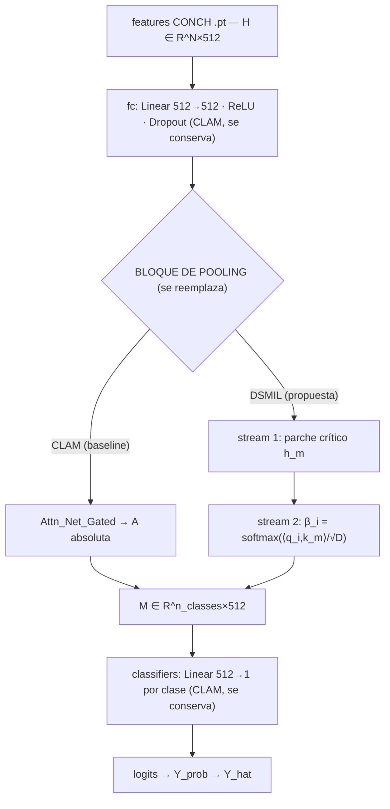

# Propuesta — DSMIL como módulo MIL alternativo

> **Estado: PROPUESTA, sujeta a confirmación** en reunión con Sebastián
> y Eduardo (decisión #6 del sprint). Este documento enuncia y justifica
> la propuesta. Si la reunión elige otro aggregator, se reescribe.
>
> **Nota de procedencia.** El argumento (secciones "Hipótesis",
> "Argumento arquitectónico" y "Riesgos") se transcribe **literal** del
> README del Objetivo 3 redactado en sesiones previas
> (antes `objetivo_3_dsmil/README.md`), que es la versión registrada en
> el repo del argumento del *sprint actual*, sección "Implementación de
> un módulo MIL alternativo". No se reinterpreta. Lo único agregado en
> esta sesión es la cita formal del paper, la URL de arXiv y el diagrama
> de integración.

## Paper de referencia

**Li, B., Li, Y., & Eliceiri, K. W. (2021).** *Dual-stream Multiple
Instance Learning Network for Whole Slide Image Classification with
Self-supervised Contrastive Learning.* IEEE/CVF Conference on Computer
Vision and Pattern Recognition (**CVPR 2021**), pp. 14318–14328.

- arXiv: <https://arxiv.org/abs/2011.08939>
- Repo oficial: <https://github.com/binli123/dsmil-wsi>
- Copia local del paper: [`../../papers/dsmil_li2021.pdf`](../../papers/dsmil_li2021.pdf)
- Copia local del código (read-only, hermano del repo personal):
  `clam_testing2/DSMIL_official_reference/` (HEAD `80465ed`).

## Hipótesis

El **attention pooling lineal** de CLAM (`M = torch.mm(A, h)` en
`models/model_clam.py:172` para CLAM_SB y `:239` para CLAM_MB) calcula la
representación del bag como **combinación lineal de embeddings de parche
ponderada por attention scores escalares**. Bajo esta formulación:

- Cada parche aporta independientemente al bag embedding.
- Las relaciones inter-parche (¿este parche es el "crítico" comparado con
  el resto? ¿hay una sola región positiva o múltiples?) no se modelan.

Este es **estructuralmente el peor caso** para tareas con patrones
**focales** — donde un único parche o región pequeña contiene la
evidencia positiva (MicroCalcificaciones es el ejemplo más claro: la
señal positiva ocupa < 1% de la WSI).

**DSMIL** (Li, Li & Eliceiri, CVPR 2021) agrega una **segunda rama
dual-stream**:

1. **Stream 1 (max-pooling instance branch)**: identifica el parche con
   score más alto — el "parche crítico" `h_m`.
2. **Stream 2 (dual aggregator)**: para cada parche `h_i`, computa
   atención **relativa al parche crítico** vía una distancia entrenable
   (producto interno proyectado). El bag embedding final es la suma
   ponderada por esa atención **relacional**, no absoluta.

Predicción: DSMIL debería **mejorar `test_auc` en MicroCalcificaciones y
C.D.I. Necrosis** (tareas focales) más que la ablation de `B` del
Objetivo 2, porque ataca el cuello arquitectónico, no el sampling.

## Métrica de éxito

> Predefinida **antes** de implementar (regla 9). No se ajusta después
> de ver resultados.

Métrica primaria:

- **Δ `test_auc` (DSMIL − baseline CLAM) ≥ +0.05** en MicroCalcificaciones
  o C.D.I. Necrosis.

Métricas secundarias:

- **No degradación material** en G.H. Dif. Tubular (n=934, patrón
  presumiblemente difuso): Δ `test_auc` ≥ −0.02. Si baja más, hay regresión.
- **Convergencia de la dual stream**: ambos componentes (max-pooling y
  dual aggregator) deben converger por separado, monitoreado vía
  inspección de logs.

Subset de evaluación y split: los mismos que Objetivos 1 y 2 (subset
binario efectivo sobre el split canónico que defina la reunión). La
comparación es **lado a lado** en la misma tabla de `resultados.md`.

## Argumento arquitectónico (formalización)

Notación (siguiendo el paper DSMIL §3):

- Bag de N parches: `H = [h_1, h_2, …, h_N] ∈ R^{N×D}` (CONCH features,
  D=512 — el 1024 era ResNet legacy; ver CLAUDE.md).
- **CLAM attention**: `α_i = softmax(w^T tanh(V h_i))`,
  `M = Σ_i α_i h_i`. Atención **absoluta**.
- **DSMIL critical instance**: `m = argmax_i c_i`, donde
  `c_i = w_c^T h_i`. Parche crítico: `h_m`.
- **DSMIL relational attention**: para cada parche,
  `q_i = W_q h_i`, `k_m = W_k h_m`. Atención:
  `β_i = softmax(<q_i, k_m> / √D)`.
- Bag embedding final: `b = Σ_i β_i (W_v h_i)`.

Lo que cambia: `α_i` depende solo de `h_i`; `β_i` depende de **la
relación entre `h_i` y `h_m`**. Para una tarea focal donde el "patrón
positivo" es único en la WSI, `β_i` colapsa a un one-hot alrededor del
parche crítico, mientras que `α_i` puede dispersarse.

### Correspondencia con el código oficial

Validado contra `DSMIL_official_reference/dsmil.py` (HEAD `80465ed`):

- `IClassifier` / `FCLayer` → Stream 1: `c = nn.Linear(D, C)` produce el
  score por instancia; `torch.max(classes, 0)` da el parche crítico.
- `BClassifier` → Stream 2: `self.q` es un MLP
  `Linear(D,128)→ReLU→Linear(128,128)→Tanh`; `self.v` es `nn.Identity`
  por defecto; la atención es `A = softmax(mm(Q, q_max^T) / √dim_Q)` y el
  bag rep `B = mm(A^T, V)`; el clasificador de bag es un
  `nn.Conv1d(C, C, kernel_size=D)`.
- En la integración con CLAM_MB **no se usa** el `Conv1d` final de DSMIL:
  se conserva el bag classifier de CLAM (`nn.Linear` por clase,
  `model_clam.py:198`). DSMIL aporta solo el mecanismo de atención.

## Diagrama de integración

Cómo DSMIL se enchufa entre las features CONCH y el bag classifier de
`CLAM_MB`. Lo que cambia es **solo el bloque de pooling** (marcado `◄──`).

```
                 features CONCH .pt
                   H ∈ R^{N×512}
                        │
                        ▼
        ┌───────────────────────────────┐
        │  CLAM_MB.attention_net[:3]     │   ← se conserva
        │  Linear(512→512) · ReLU · Drop │
        └───────────────────────────────┘
                        │  h ∈ R^{N×512}
                        ▼
   ╔═══════════════════════════════════════════╗
   ║   BLOQUE DE POOLING  ── lo único que       ║
   ║   se reemplaza ──                          ║
   ║                                            ║
   ║   CLAM:   Attn_Net_Gated → A   (absoluta)  ║  ◄── REEMPLAZADO
   ║   DSMIL:  dual-stream                      ║
   ║     stream 1: c_i = w_c·h_i → h_m crítico  ║
   ║     stream 2: β_i = softmax(<q_i,k_m>/√D)  ║
   ║              b_c = Σ_i β_{i,c} (W_v h_i)   ║
   ╚═══════════════════════════════════════════╝
                        │  M ∈ R^{n_classes×512}
                        ▼
        ┌───────────────────────────────┐
        │  CLAM_MB.classifiers           │   ← se conserva
        │  Linear(512→1) por clase       │   (model_clam.py:198)
        └───────────────────────────────┘
                        │
                        ▼
                logits → Y_prob → Y_hat

   Rama instance (top-B/bottom-B + SmoothTop1SVM):  ── se conserva ──
   inst_eval / inst_eval_out  (model_clam.py:107 / :128)
   Loss:  bag_weight·L_bag + (1−bag_weight)·L_instance  (core_utils.py)
```

Equivalente en mermaid:



## Riesgos identificados

- **DSMIL fue diseñado pensando en CTransPath / SimCLR features**, no
  CONCH. La adaptación al feature space de CONCH (512-dim) no debería
  ser problemática (es solo cambiar `D` y las dimensiones de
  `W_q, W_k, W_v`), pero requiere validación temprana con un smoke test.
- **Combinación con SmoothTop1SVM**: el paper DSMIL usa una loss
  diferente (bag-level BCE + max-pooling BCE; ver
  `DSMIL_official_reference/train_mil.py`, `loss = 0.5·L_bag + 0.5·L_max`).
  Decisión a tomar: ¿se replica la loss del paper o se mantiene
  `--bag_loss ce --inst_loss svm` para comparabilidad con el baseline?
  **Default: mantener bag+inst loss de CLAM** para que la única variable
  sea el aggregator.
