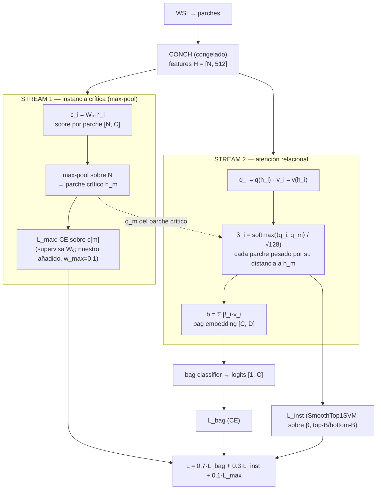
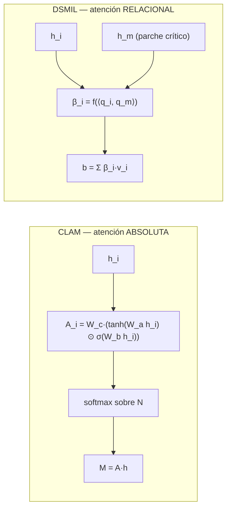

# Diagrama DSMIL + por qué lo elegimos — para la presentación

> Pedido por Sebastián (reunión 26-may): diagrama del funcionamiento de DSMIL
> en arquitectura + diferencias/ventajas vs CLAM (motivación de la elección).
> Grounding factual: `objetivo_3_modulo_mil_alternativo/investigacion/03_comparacion_clam_dsmil.md`
> (líneas verificadas contra `clam_environ/models/model_clam.py` y
> `DSMIL_official_reference/dsmil.py`). Estilo: "Diagramas > texto plano"
> (CLAUDE.md). Notación: N=parches del bag, D=512 (CONCH), C=clases.

---

## 1. Diagrama de arquitectura — DSMIL dual-stream (mermaid)

Punto clave: el **parche crítico h_m** (Stream 1) es el que orienta TODA la
atención del Stream 2 — cada parche se pesa por cuánto se parece al crítico, no
de forma aislada.

---

## 2. La diferencia en una imagen — atención absoluta vs relacional

Detalle crítico: en CLAM `A_i` depende **solo de h_i** (cada parche puntuado
por su cuenta). En DSMIL `β_i` depende de la **relación h_i ↔ h_m**. Por eso
DSMIL puede, en teoría, concentrar la atención alrededor de la región más
sospechosa en lugar de repartirla parche por parche.

---

## 3. Tabla CLAM vs DSMIL (para slide)

| | CLAM (el nuestro) | DSMIL |
|---|---|---|
| Pooling | atención gated **absoluta** | dual-stream: instancia crítica + atención **relacional** |
| Cada parche se pesa | de forma **independiente** | por su **distancia al parche crítico h_m** |
| Bag embedding | M = A·h | b = Σ β_i·v_i |
| Esqueleto MIL | features→proyección→pooling→clasificador+rama instancia | **igual** |
| Swap | — | reemplazar **solo el bloque de pooling** (no reescritura) |

---

## 4. Por qué elegimos probar DSMIL — speaker notes

BLOQUE 1 — Qué comparten
-> CLAM y DSMIL son el mismo esqueleto MIL: features CONCH → proyección →
   pooling con atención → clasificador de bag + rama de supervisión de instancia.
-> Difieren en UN bloque: el pooling. Por eso el cambio es un swap, no una
   reescritura — aísla limpio la variable "aggregator".

BLOQUE 2 — La hipótesis clínica
-> Una microcalcificación es un punto muy pequeño dentro de una WSI enorme.
-> La atención absoluta de CLAM puntúa cada parche por su cuenta; la señal
   positiva, escasa y co-localizada, se puede diluir entre miles de parches.
-> La atención relacional de DSMIL ancla todo en el parche crítico y pondera el
   resto por cercanía a él → encaja con señal focal.
Punto clave: por eso DSMIL es candidato razonable para microcalcificaciones, no
por moda — es un argumento de focalidad de la señal.

BLOQUE 3 — Qué encontramos (honestidad)
-> Sobre las 3 binarias separadas (333 slides identificadas, job 4137) DSMIL
   FRACASÓ en balanced_accuracy (carcinoma Δ −0.10) — pero el diagnóstico fue
   "cuello = datos" (264 slides de train), no la arquitectura.
-> En test_auc el mismo run NO fue desastre (carcinoma DSMIL 0.824 > CLAM 0.808);
   DSMIL ordena bien pero umbraliza mal a ese n.
Detalle crítico: el veredicto negativo era de DATOS, no de aggregator.

BLOQUE 4 — Por qué lo reabrimos en el fusionado
-> El binario fusionado "tiene/no tiene" tiene ~2250 slides de train (vs 264).
-> DSMIL ya NO está hambriento de datos → recién acá la comparación de
   arquitecturas es justa.
-> Lo corremos con el MISMO harness que CLAM (mismo train/val/test, mismos
   splits k=3) → apples-to-apples.
Punto clave: no es "DSMIL otra vez", es "DSMIL en el régimen donde la
comparación recién tiene sentido".

BLOQUE 5 — Dónde queda DSMIL frente a mammoth
-> mammoth (Eduardo/Sebastián) ya gana en 3 tasks reemplazando la primera capa
   FC de CLAM → tiene respaldo empírico interno.
-> DSMIL es nuestra exploración de aggregator con argumento de focalidad; si en
   el fusionado tampoco mueve la aguja, mammoth es el siguiente candidato natural.

---

## 5. Notas de uso

- Los bloques mermaid se exportan a PNG (o se rehacen en OnlyOffice con el
  estilo visual de `Modelo_OncoMets_Spatial_V1.pdf`).
- Toda fórmula va inline sin LaTeX (formato speaker-notes B2).
- El resultado de Fase 2 (job 4172, DSMIL vs CLAM sobre el fusionado) **se
  pega en BLOQUE 4** cuando termine el chain — hoy PENDIENTE.
