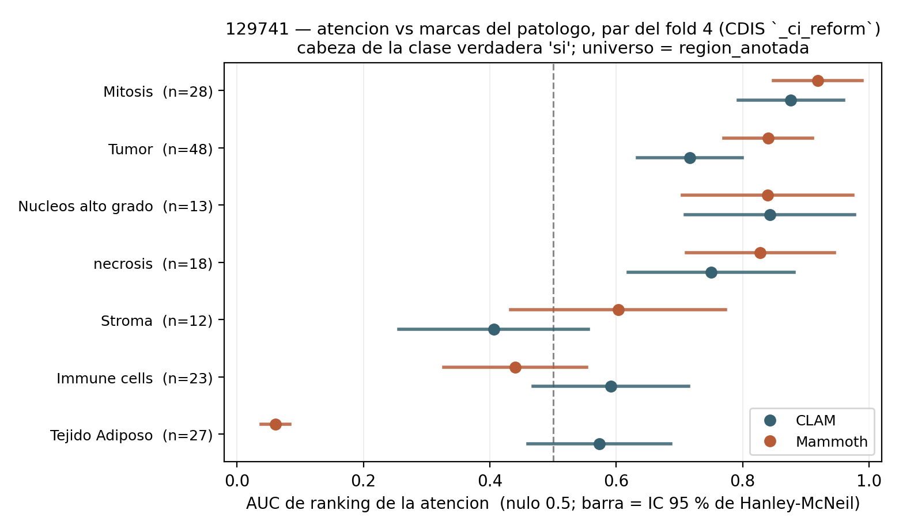

# AUC de ranking del par CLAM/Mammoth del fold 4 (fase 1, paso 6)

> Medido el **17-ago-2026**, CPU post-hoc, segundos.
> Script: [scripts/auc_atencion_fold4.py](scripts/auc_atencion_fold4.py).
> Salida: `results/b8_hovernext_129741/auc_fold4/`.
>
> Cierra el **paso 6 de la fase 1** del [plan del 17-ago](plan_semana_17ago.md), que estaba marcado
> como opcional y quedó pendiente. Se pudo hacer ahora porque la fase 2 sigue bloqueada en la cola
> ([coordinacion_gpu.md](coordinacion_gpu.md)) y porque `--dump-attention` ya dejó la atención por
> parche persistida: no hay que reconstruir CLAM ni cargar pesos.

---

## Qué es, y qué no es

El **AUC de ranking** de la atención contra las marcas del patólogo: P(un parche marcado recibe más
atención que un parche cualquiera del resto). Nulo 0,5. Es la U de Mann-Whitney normalizada.

Lo importante para no confundirlo con lo ya medido:

- **No es el 0,890.** Ese sale de 12 checkpoints de **tasa mitótica** de Sebastián
  ([atencion_vs_patologo/resultados.md](../atencion_vs_patologo/resultados.md)). Este es **un par**
  de **CDIS `_ci_reform`**, fold 4, job 4589: otra tarea, otro régimen de entrenamiento.
- Por eso **no es una réplica** de aquel número, y **no lo re-mide**. Es una medición nueva sobre las
  mismas marcas con un modelo que llegó por otra puerta, que es justamente lo que la vuelve
  interesante.
- **No hay sd entre checkpoints**: hay un solo par. La única incertidumbre reportable acá es el IC
  de Hanley-McNeil, que igual es la grande de las dos ([[auc-atencion-dos-incertidumbres]]).

## Cómo se midió

- Atención por parche del `atencion_por_parche.npz` de la fase 1 (cabeza de la clase verdadera,
  `si`), los dos brazos del mismo fold.
- Dos universos: la lámina entera (4799 parches) y **confinado a la región anotada** (2496), que es
  el control contra "una región de escaneo recibe más atención que la otra".
- IC 95 % por **Hanley-McNeil**, que varía *lo que el patólogo marcó* con el modelo fijo.
- **Nulo honesto por traslación rígida** de la máscara sobre la grilla, no permutación de etiquetas:
  las marcas son contiguas y permutar da un p optimista ([[nulo-espacial-traslacion-rigida]]).
  Se pagó solo para los tres grupos que deciden algo; el resto lleva AUC e IC igual.
- Los estadísticos se **importan** de `atencion_vs_anotaciones.py`, no se copian. Su `CKPTS` está
  atado a un pre-registro y no se toca: por eso esto va como script aparte.

## El resultado

Confinado a la región anotada, cabeza de la clase verdadera:

| Grupo | n | CLAM | IC 95 % | Mammoth | IC 95 % | p tras. CLAM | p tras. Mam. |
|---|---|---|---|---|---|---|---|
| **Mitosis** | 28 | 0,876 | 0,793-0,960 | **0,918** | 0,848-0,989 | **0,0121** | **0,0008** |
| Tumor | 48 | 0,717 | 0,634-0,799 | 0,840 | 0,770-0,911 | 0,1797 | 0,0702 |
| Núcleos alto grado | 13 | 0,843 | 0,709-0,977 | 0,839 | 0,704-0,974 | 0,0740 | 0,0520 |
| necrosis | 18 | 0,750 | 0,619-0,881 | 0,828 | 0,711-0,946 | . | . |
| Stroma | 12 | 0,406 | 0,256-0,556 | 0,603 | 0,433-0,773 | . | . |
| Immune cells | 23 | 0,592 | 0,469-0,715 | 0,440 | 0,328-0,553 | . | . |
| Tejido adiposo | 27 | 0,573 | 0,460-0,686 | **0,061** | 0,038-0,084 | . | . |

Sobre la lámina entera los números de mitosis son 0,874 (CLAM) y 0,919 (Mammoth).

**Seis lecturas:**

1. **Corrobora el 0,890 desde otra tarea.** Dos checkpoints entrenados para decidir CDIS, que nunca
   vieron una etiqueta de mitosis, ordenan las marcas de mitosis en 0,876 y 0,918. El valor de
   Sebastián queda entre los dos. Que el alineamiento aparezca con dos familias de checkpoint
   independientes dice que no es una propiedad de una corrida.
2. **Sobrevive el nulo espacial**, que es el que importa: p = 0,012 (CLAM) y 0,0008 (Mammoth).
   Trasladar la máscara a otro lado de la misma región baja el AUC, o sea el efecto está en *dónde*
   marcó el patólogo y no en la forma del grupo.
3. **Tumor NO sobrevive** (p = 0,18 y 0,07) pese a un AUC de 0,72 y 0,84. Es exactamente para lo que
   sirve el nulo honesto: tumor es una mancha grande y contigua, así que trasladarla la deja sobre
   tejido parecido. Un AUC alto con p de traslación alto significa "atiende esa zona", no "atiende
   esas marcas". **No presentar Tumor como resultado.**
4. **Los dos brazos clasifican MAL esta lámina** (los dos predicen `no`, la verdad es `si`) y aun así
   ponen las mitosis en el percentil 93 a 95. La atención sabe dónde mirar aunque la decisión de
   lámina falle. Es el mismo patrón de [[tareas-geometricas-mitosis-grado-nuclear]] y refuerza que
   el cuello no está en dónde mira el modelo.
5. **La diferencia más grande entre los dos brazos es el tejido adiposo**, y es de Mammoth: 0,061
   contra 0,573. Leído con la simetría del estadístico, Mammoth tiene 94 % de probabilidad de dar
   más atención a un parche cualquiera que a uno de grasa, o sea la **evita**; CLAM no la distingue
   del resto (su IC cruza 0,5). Es coherente con que Mammoth ordene mejor en el techo.
6. **Confinar a la región no mueve nada** (0,874 a 0,876; 0,919 a 0,918). Descarta de nuevo que se
   esté midiendo la región de escaneo en lugar de las marcas.

## Chequeo de sanidad, pasado

Los percentiles confinados a la región reproducen **exacto** los de la fase 1
(`percentil_atencion_por_grupo.csv`: 0,9353 CLAM y 0,9497 Mammoth). El `0,914 contra 0,872` que cita
[techo_atencion.md](techo_atencion.md) es el percentil **medio** de ese mismo archivo, bien citado:
no es el AUC, aunque los valores queden cerca.

## Qué no se afirma

- **No se afirma que Mammoth rinda.** Esto es orden de parches, no métrica de lámina, y de hecho los
  dos brazos fallan la clasificación de esta lámina. **No reabre el Hallazgo 12.**
- **Un par, un fold, una lámina, un anotador.** Sin sd entre checkpoints. Las diferencias CLAM contra
  Mammoth se miran con eso puesto.
- **El ancho del IC manda sobre la escalera.** Estroma (IC 0,26-0,56 y 0,43-0,77) y núcleos de alto
  grado (0,71-0,98) **no se pueden leer** en esta lámina: es ausencia de dato, no dato.
- **Los positivos son parciales.** Fuera de las marcas puede haber mitosis reales, y el sesgo empuja
  todo AUC hacia 0,5. Es conservador, que no es lo mismo que exacto.
- **Los cuatro grupos sin p de traslación no están validados espacialmente**, solo descritos.
