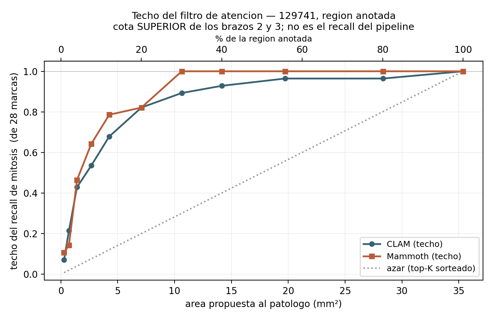

# El techo del filtro de atención — la fase 3 acotada por arriba, sin gastar GPU

> Medido el **17-ago-2026**, CPU post-hoc. Script: [scripts/techo_atencion_topk.py](scripts/techo_atencion_topk.py).
> Salida: `results/b8_hovernext_129741/techo_atencion/`.
>
> Se hizo porque la fase 2 quedó bloqueada en la cola (ver
> [coordinacion_gpu.md](sprints/B8_sprint8/hovernext_129741/coordinacion_gpu.md)) y **esta parte
> de la fase 3 no depende de HoVer-NeXt**.
>
> **Nota del 19-ago-2026 — el segundo factor YA SE MIDIÓ.** La lectura 1 de abajo cierra con «lo
> que falta medir es cuánto de ese margen se come la detección»: era cierto el 17-ago y se deja
> como está, porque es el registro de por qué se hizo el cruce. La respuesta está en
> [cruce_marcas.md](sprints/B8_sprint8/hovernext_129741/cruce_marcas.md): **13 de 26 marcas**, y
> desde K=189 el factor que manda es la detección y no la máscara. **Ojo con la unidad**: este
> documento cuenta **parches con marca (28)** y el cruce cuenta **marcas (26)**; las dos tablas
> no se encadenan.

---

## Qué es, y qué no es

La fase 3 compara tres brazos. Los brazos 2 y 3 enmascaran la salida de HoVer-NeXt con el top-K
por atención de CLAM y de Mammoth. **Un parche que no entra en la máscara no lo puede recuperar
nadie**, por bueno que sea el detector. Entonces:

```
recall_fase3(K)  ≤  min( techo_atencion(K) ,  detección_de_HoVer-NeXt )
```

El primer factor **no necesita GPU**: sale de ordenar la atención que ya tenemos. El segundo sí, y
es lo que fija el brazo 1 cuando el 4998 corra.

Esto es el **patrón P2** aplicado de frente — «declarar el denominador alcanzable **antes** de
correr la prueba». Si el techo fuera bajo a los K interesantes, la fase 3 estaría condenada y
convendría saberlo antes de gastar la GPU, no después.

**No es** el recall de la fase 3, **no mide a HoVer-NeXt**, y el denominador 28 son *las marcas del
patólogo*, no *las mitosis que hay* (positivos parciales).

## Cómo se midió

- Atención por parche del par CLAM/Mammoth del **fold 4** del job 4589, tarea
  `carcinoma_ductal_insitu_presente_ci_reform` — el mismo par de la fase 1.
- **Confinado a la región anotada** (la de abajo): 2496 de los 4799 parches, **35,37 mm²**.
  Las **28/28** marcas de Mitosis caen ahí, como debía ser.
- K barrido en los 11 valores del plan. Área = K × 0,014171 mm² (parche de 256 px a 0,465 µm/px).
- Referencia sin información: el mismo top-K **sorteado al azar** dentro de la región.

## El resultado



| K | área mm² | % región | CLAM | Mammoth | azar |
|---|---|---|---|---|---|
| 20 | 0,28 | 0,8 % | 2/28 | **3/28** | 0,22 |
| 50 | 0,71 | 2,0 % | **6/28** | 4/28 | 0,56 |
| 100 | 1,42 | 4,0 % | 12/28 | **13/28** | 1,12 |
| 189 | 2,68 | 7,6 % | 15/28 | **18/28** | 2,12 |
| 300 | 4,25 | 12,0 % | 19/28 | **22/28** | 3,37 |
| 500 | 7,08 | 20,0 % | 23/28 | 23/28 | 5,61 |
| 750 | 10,63 | 30,0 % | 25/28 | **28/28** | 8,41 |
| 1000 | 14,17 | 40,1 % | 26/28 | 28/28 | 11,22 |
| 1392 | 19,73 | 55,8 % | 27/28 | 28/28 | 15,62 |
| 2000 | 28,34 | 80,1 % | 27/28 | 28/28 | 22,44 |
| **2496** | **35,37** | **100 %** | **28/28** | **28/28** | 28,00 |

**Tres lecturas:**

1. **El techo no condena la fase 3.** A **4,25 mm² (12 % de la región)** el techo ya es 19/28 en
   CLAM y 22/28 en Mammoth, con enriquecimiento **5,7× y 6,5×** sobre el azar. O sea que la
   pregunta de Sebastián — proponerle al patólogo un área chica que igual contenga las mitosis —
   **tiene margen**, y lo que falta medir es cuánto de ese margen se come la detección.
2. **Mammoth ordena mejor, y llega al techo completo antes.** Alcanza 28/28 en **K = 750**
   (10,6 mm²); CLAM no lo alcanza hasta barrer la región entera. Mammoth es ≥ CLAM en 9 de los
   11 K, con **K = 50 la única inversión clara** (6 vs 4). Es coherente con la fase 1, donde
   Mammoth pone Mitosis en percentil 0,914 contra 0,872 de CLAM.
   **No reabre el Hallazgo 12**: es orden de parches, no métrica de lámina — y los dos brazos
   siguen clasificando mal esta lámina.
3. **El top-20 vuelve a dar 2-3 de 28**, con un par de checkpoints **de otra tarea** que los que
   dieron el número original. Corrobora [[topk-percentil-no-auc]] de forma independiente: un
   ranking bueno no implica que un top-k chico capture nada.

## Un chequeo de sanidad de la fase 3, ya aprobado

El plan exige que **en K = 2496 los tres brazos den idéntico**, y que si no, hay un bug en el
enmascarado. En el techo eso ya se cumple: **28/28 en los dos brazos**, y la curva del azar
converge al mismo punto. Cuando corra el 4998, ese chequeo hay que repetirlo sobre el recall real.

## Qué no se afirma

- **No se afirma nada sobre HoVer-NeXt.** No corrió. El brazo 1 sigue sin techo medido.
- **Una lámina, un anotador, un par de checkpoints, un fold.** Nada de esto generaliza a la
  cohorte, y la 129741 ya se sabe que **no es representativa** ni siquiera en geometría de escaneo.
- **Los positivos son parciales**: fuera de las 28 marcas puede haber mitosis reales sin marcar.
  El sesgo empuja el techo hacia abajo, así que es conservador — pero conservador no es exacto.
- **El área no es el costo real para el patólogo.** Se cuenta área de parches contiguos o no; una
  máscara fragmentada en 750 parches sueltos no cuesta lo mismo de revisar que una región compacta
  del mismo tamaño. **Eso no está medido.**
- La diferencia CLAM vs Mammoth se mide **sin barra de error**: es un fold y una lámina, y la
  inversión en K = 50 muestra que la curva no es monótona entre brazos.
